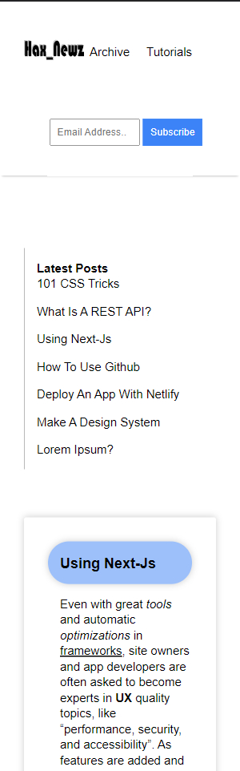

# Hax_Newz

This is a project that was assigned by Udacity as part of their *Nano-Degree* Front End Developer Certification Program.

The assignment is to create a personal blog website with the use of CSS-Grid & Flex-Box. 

---

# Launching The Project

If you are using VS-Code, you can use the Live-Server extension to launch the website on localhost.

---

# Responsive Design

## Mobile Device / 320px : 

## Mobile Device / 480px : 

## Mobile Device / 547px : 

## Tablet / 720px : 

## Tablet / 900px : 

## Desktop / 1080px : 

## Desktop / 1280px : 

## Desktop / 1440px : 

